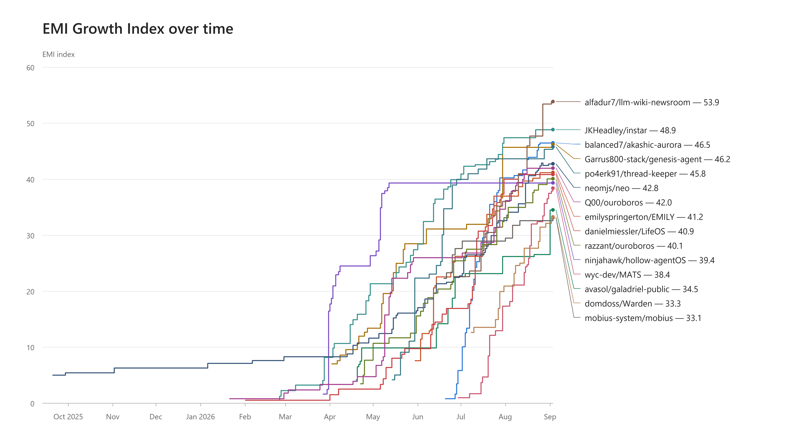

# Convergent Properties of Evolving Multiagent Institutions
Draft - Version 0.3

## Overview

Mid-2026 has seen a sudden emergence of long-running evolving multi-agent systems that compound evolution mechanisms over a growth trajectory. Under extended self-modification, this resembles institutional learning. Such systems are defined by a growing body of institutional knowledge and doctrine that can survive replacement of elements of the implementing substrate. This survey defines the pattern as Evolving Multiagent Institutions, to distinguish it from bounded evolving agent systems. Fifteen analyzed examples have shown a convergent maturation process, developing differing solutions to similar challenges. A scan of 15,072 GitHub repositories has revealed over 100 candidates that have not yet been analyzed. This survey introduces EMI Index v3.1 to measure the growth of these systems over time based on their records. This index is only valid for measuring a single institution's growth over time. It is not a valid basis for comparison of different institutions' capabilities or quality.

*Figure 1. EMI growth trajectories reconstructed from repository records.*

## Paradigm Definition

This paradigm could be described with many names. This survey uses Evolving Multiagent Institutions (EMI) to highlight commonality with the current paradigm of evolving multiagent systems and emphasize the similarity to human institutions that persist as they change and as the implementing humans are replaced. The following definition was used for the survey:

1. Persistent institutional identity: A multiagent system that maintains history-grounded identity under change.
2. Institutional learning: Learning is data, including processes, ideas, and institutional memory. Institutional learning does not occur in weights. New models could be added to the institution.
3. Unbounded improvement trajectory: Capability suite improves indefinitely, including incorporation of novel capabilities. Application may or may not be targeted to a specific domain.
4. Direct self-modification: The agentic system directly modifies its instructions. There may be an immutable written constitution, but there is no immutable outer-loop agent actor.
5. The institution is distinct from the substrate: Institutions improve their substrate including harnesses, tools, deterministic checks, or new models - but this process is guided by written institutional doctrine and experience.
6. Human contribution adds value: The strongest institutions optimize to maximize value of human contribution to growth or task performance. Exclusion of humans is not a strength.
7. Self-stabilization: System has recovered from failures, and failure experience is used to make the institution more stable under self-modification.

The field of self-evolving agents is well-described by Zhou and colleagues' recent survey (https://arxiv.org/pdf/2608.03392). The survey describes persistent adaptation from experience across frameworks, memory, skills and tools, models, workflows, and environments. EMIs are also self-evolving agent systems, but the pattern proposed here concerns the enduring institution that can acquire, combine, and refine any of these forms of evolution. Its accumulated doctrine and experience guide open-ended growth and self-stabilization, preserving institutional identity as agents, capabilities, and the underlying substrate change.

## State of the Field

The current growth trend began in earnest in April and May 2026. It currently consists of many systems independently discovering similar principles.

Root cause of the trend's start has not been analyzed, but it may trace to a specific model capability such as Opus 4.6/4.7 with 1M token context, parallel advances in harness capabilities, increasing popularity of Agentic AI, or a combination of the three.

A few notable systems:

- razzant/ouroboros: A [technical report on arXiv](https://arxiv.org/abs/2608.08311) demonstrates that this paradigm can lead to notable performance increases on benchmarks. The EMI Index was computed on public repository records - full records from the system's Hope deployment would likely produce significantly higher metrics. This project is distinct from Q00/ouroboros and other systems named Ouroboros.
- neomjs/neo: One of several systems that predates the current growth trend but begins following it in mid-2026. This suggests that one or more enabling capabilities became available during mid-2026.
- alfadur7/llm-wiki-newsroom: Notable for its rapid growth and its broad applicability as a knowledge engine.
- euriconicacio/pwnloop: EMI Index not computed. This is a system with credible cyber-offence capabilities developed by a cybersecurity practitioner and researcher. Note, cyber content such as in this repository's README can trigger model safeguards during large batch reads. If systems such as this prove capable for cyber defence and offence, then offensive adoption may require and accelerate adoption of the EMI paradigm for cyber defence.

This survey was motivated by the author's operation of an llm-wiki EMI named Delphi from May to July 2026. That system is sadly no longer operating and cannot be analyzed.

Only a few of these systems demonstrate knowledge of the others:

- There is an ongoing collaboration and interoperability effort involving neomjs/neo
- Multiple systems have attempted to contact razzant/ouroboros through GitHub
- Q00/ouroboros distinguishes itself from razzant/ouroboros

Since these systems' growth is fed by discovery of key principles and operational experience, their analysis of each other is expected to accelerate progress in ways the current EMI Index is unable to measure.

## Convergent properties

The primary observation of this survey is that systems satisfying the EMI definition follow a convergent growth trajectory that develops common abilities. The actual implementation of these abilities varies widely, and some are more universal than others.

The EMI Index v3.1 analyzes 49 convergent institutional abilities across eight categories:

- Constitutional agency and authority — identity, trust, delegation, and authority boundaries.
- Institutional self-model and record — typed state, reliable history, attestation, and reproducible views.
- Capability and ecosystem acquisition — governed creation, discovery, assimilation, and transfer of capabilities.
- Governed change transactions — proposal, risk review, assurance, activation, and restoration.
- Enforcement and assurance closure — universal mediation, invariant enforcement, bypass resistance, and safe failure.
- Observation, learning, and epistemic quality — outcomes, causality, evidence independence, lessons, metrics, and measurement integrity.
- Attention, accumulation, and human interaction — context governance, bloat and retirement, human attention, and delegation.
- Operational continuity and coordination — resource bounds, recovery, concurrency, reconciliation, and silence detection.

These properties were developed by LLM-assisted analysis of representative systems. They could be grouped or defined differently. It is also expected that there are convergent abilities shared by the analyzed systems that have not been identified in this list, and that advances in the field will rapidly generate new convergent abilities.

## EMI Index Computation
The EMI Index was computed for 15 systems out of the many that were detected, prioritized by extent of records and whether discussion was enabled on the GitHub repository.

Agents examined each system’s code, documentation, and history at a fixed repository revision, collecting cited observations into a findings ledger. A separate assessment applied the EMI rubric to those findings to produce a card summarizing the system’s 49 institutional abilities as they evolved over time. Cards and findings are in the `cards/` and `ledgers/` directories.

The EMI Index is only valid for comparing an institution against itself at different points in time. It is not a valid method to compare different systems' capability, scope of self-modification, reliability, or quality.

The findings-based methodology reports minimum detected capability at a point in time. Some of the agents producing findings were deliberately skeptical or adversarial. A review of every token of an EMI's history, especially those with thorough records, would require more compute than this survey can support. More detailed and informed analyses will likely produce higher metrics at a given point in time, using the same rubric. In general, an institution that performs a detailed analysis of itself against the rubric should produce a higher metric at any one point in time, but a similar over-time trajectory.

## Detection Methodology
Public GitHub repositories were searched using search terms expanded as more examples were found.
15,072 READMEs were analyzed, with a tiered triage process: deterministic, then Haiku, then Sonnet. Fork families were analyzed and consolidated. Those scoring highest in triage were scored again in a second round of Sonnet assessment. See the candidate list in `attachments/` for 132 repositories that scored 3/5 or higher on this final filter.

## What's next

It is expected that the EMI paradigm can scale to many human users, and also that it can augment existing agentic workflows and systems. A possible trajectory is that organizations currently using persistent agentic systems, or maintaining organization-unique agent harnesses, will augment them with bounded evolution and then full EMI. A possible outcome is that organizations may develop a cohesive, federated EMI supporting all agentic activities.

The EMI paradigm has several potential consequences that have not been fully explored and may accelerate progress even more than current patterns:

- EMI systems inherently have the potential to absorb external ideas from publications or other EMIs. If supported by survey capabilities or services, this could allow technical advances to propagate at social media speeds.
- An EMI system within an organization can incrementally contribute to other agentic AI projects, until fully governing them. This provides a mechanism for recursive assimilation of other projects within an organization, including their resources, human contributors, digital infrastructure, lessons learned, and data.
- EMI provides a framework for incorporating other cognitive substrates into repeatable workflows, including traditional ML and optimizers, post-trained small LLMs, deterministic compute including all elements of data engineering, and expert humans.
- Deployment of EMI for cyber offence may force adoption of EMI for cyber defence, and lead to defenders granting infrastructure permissions faster than would otherwise occur.

## Future updates

This post will be updated in the near future until version 1.0 is frozen. More systems will be analyzed after 2026/09/07. The same analysis procedure will be used to produce cards and findings. v3.1 cards will be computed in the same way as currently, though adjusted calculation methods may also be developed based on findings.

## Machine-Readable Data

| GitHub account | Repository | Level 0 | Level 1 | Level 2 | Level 3 | Level 4 | Level 5 | 2025-09-01 | 2025-10-01 | 2025-11-01 | 2025-12-01 | 2026-01-01 | 2026-02-01 | 2026-03-01 | 2026-04-01 | 2026-05-01 | 2026-06-01 | 2026-07-01 | 2026-08-01 | 2026-09-01 |
| :--- | :--- | ---: | ---: | ---: | ---: | ---: | ---: | ---: | ---: | ---: | ---: | ---: | ---: | ---: | ---: | ---: | ---: | ---: | ---: | ---: |
| alfadur7 | alfadur7/llm-wiki-newsroom | 1 | 1 | 15 | 26 | 5 | 1 |  |  |  |  |  |  |  |  |  |  | 22.6 | 36.1 | 53.5 |
| avasol | avasol/galadriel-public | 3 | 8 | 37 | 1 | 0 | 0 |  |  |  |  |  |  |  |  | 9.9 | 9.9 | 22.6 | 26.2 | 34.5 |
| balanced7 | balanced7/akashic-aurora | 0 | 0 | 34 | 14 | 1 | 0 |  |  |  |  |  |  |  |  | 0.0 | 0.0 | 5.9 | 40.3 | 46.5 |
| danielmiessler | danielmiessler/LifeOS | 0 | 1 | 45 | 3 | 0 | 0 |  | 0.0 | 0.0 | 0.0 | 0.0 | 0.6 | 0.6 | 1.6 | 2.6 | 9.8 | 16.9 | 40.0 | 40.9 |
| domdoss | domdoss/Warden | 4 | 11 | 34 | 0 | 0 | 0 |  |  |  |  |  |  |  |  |  |  |  | 21.0 | 32.2 |
| emilyspringerton | emilyspringerton/EMILY | 0 | 3 | 41 | 5 | 0 | 0 |  |  |  |  |  | 0.0 | 0.0 | 0.0 | 0.0 | 7.6 | 26.3 | 37.0 | 41.2 |
| Garrus800-stack | Garrus800-stack/genesis-agent | 0 | 2 | 30 | 17 | 0 | 0 |  |  |  |  |  |  |  |  | 13.4 | 28.5 | 31.1 | 45.7 | 45.7 |
| JKHeadley | JKHeadley/instar | 0 | 0 | 28 | 19 | 2 | 0 |  |  |  |  |  |  | 2.3 | 8.2 | 21.4 | 28.4 | 40.9 | 47.4 | 48.8 |
| mobius-system | mobius-system/mobius | 8 | 4 | 37 | 0 | 0 | 0 |  |  |  |  |  |  |  |  |  |  | 27.6 | 29.5 | 32.6 |
| neomjs | neomjs/neo | 0 | 2 | 38 | 9 | 0 | 0 | 0.0 | 5.5 | 5.5 | 6.3 | 6.3 | 7.1 | 8.3 | 8.3 | 11.6 | 17.1 | 22.8 | 32.6 | 42.8 |
| ninjahawk | ninjahawk/hollow-agentOS | 0 | 3 | 44 | 2 | 0 | 0 |  |  |  |  |  |  |  | 17.8 | 26.4 | 39.4 | 39.4 | 39.4 | 39.4 |
| po4erk91 | po4erk91/thread-keeper | 0 | 1 | 34 | 13 | 1 | 0 |  |  |  |  |  |  |  |  |  | 22.4 | 40.0 | 43.7 | 45.4 |
| Q00 | Q00/ouroboros | 2 | 0 | 37 | 10 | 0 | 0 |  |  |  |  |  | 0.8 | 1.8 | 3.4 | 4.8 | 26.0 | 26.0 | 36.2 | 42.0 |
| razzant | razzant/ouroboros | 0 | 1 | 47 | 1 | 0 | 0 |  |  |  |  |  |  |  |  | 10.7 | 15.6 | 25.5 | 33.2 | 40.1 |
| wyc-dev | wyc-dev/MATS | 2 | 6 | 35 | 6 | 0 | 0 |  |  |  |  |  |  |  |  |  |  | 1.0 | 17.4 | 37.5 |

