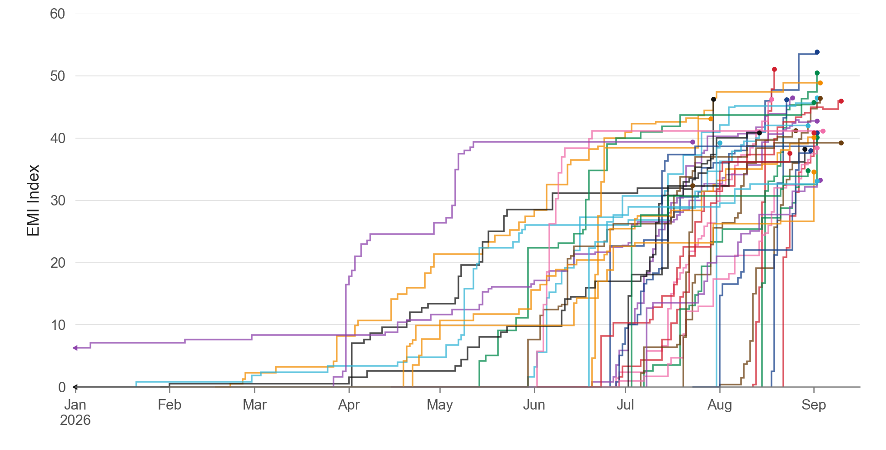
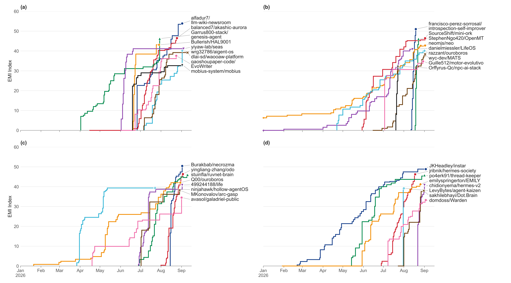

# Convergent Properties of Evolving Multiagent Institutions

Paul Hudgins · Version 1.0.7 · October 2026

## Introduction

By mid-2026, a growing set of long-running AI systems was combining persistent memory, multi-agent collaboration, and self-modification. These systems use accumulated experience to revise their operating rules, build new tools, and, in some cases, rewrite the harnesses they run on. Improvements can compound when lessons from earlier work change how the system develops, evaluates, and adopts later improvements. Over an extended trajectory, this resembles institutional learning: knowledge and doctrine accumulate outside model weights and carry forward as agent sessions end, models change, and infrastructure is replaced. This survey defines the pattern as Evolving Multiagent Institutions, distinguishing it from evolution bounded to a particular task or optimization loop.

In total, 15,072 GitHub repositories were inspected in search of EMIs that made their records publicly available. Over 100 candidates were found and 34 were analyzed. An EMI index was developed to measure the maturity of 49 institutional abilities informed by example systems. The results support substantial development within the scored histories and specific examples of convergence.

*Figure 1. Replayed EMI Index trajectories of the 34 scored systems. Each line begins at the system's observed history floor; neo and LifeOS, whose histories begin before 2026, enter at the left edge.*

The central observation is that convergent evolution appears to be based on experienced pitfalls, with reflection and often human intervention. These were not controlled experiments of fully autonomous AI evolution. Just the opposite: they involved iterative discovery of pitfalls and development of methods to overcome them. Across the selected repositories, experience led to more explicit authority, more durable records, new checks of consequential relationships, and additional ways to recover interrupted work.

This is an exploratory survey of a developing phenomenon. Its methods and surviving records support a coarse picture rather than precise comparisons between systems. Across the selected histories, however, a recurring pattern is visible: operational experience changes how subsequent work is organized, checked, and recovered. Understanding that process matters because institutional development could expand practical AI capabilities even without improvements to the underlying models.

## AI institutions

The idea that AI agents can organize into something like institutions is not new, and this survey is one of several recent attempts to describe it. What is new in 2026 is a cluster of reports from people operating persistent multi-agent systems. Patel, Wierson and Ekker (UViiVE) describe a fleet of AI scientists that turned fabrication errors found in production into an agent-authored norm, then a verification pipeline, then a trust architecture; they call this "AI Autopoietic Behavior". Steve Yegge reports that the agents running his Wheelhouse software factory grew a constitution, case law and enforcement machinery out of daily postmortems, without his asking for one. Michael Quan (Tutorwise) develops a theory of persistent computational organization and documents, with unusual candor, the verification failures his own operating case ran into. Michael Saleme's Constitutional Self-Governance framework, in production since January, ratifies constitutional amendments and gates on learning velocity, though it treats minimizing human involvement as a goal where this survey argues the opposite. Paul Gwamanda's audit of the AIRI Lattice institution shows the other side of self-modification: 44% of its 167 durable self-modifications cited a metric that turned out to be invalid. Lucian Zhu's Fluid Structure, Rigid Record offers a designed rather than emergent counterpart and deliberately defers self-evolution. Nicolae Rusan argues that AI organizations, rather than individual agents, may be the right unit for safety work.

This survey uses the term "institution" because of its emphasis on evolution and persistent identity. The term "agent organization" would be accurate as well, but it could also describe large ephemeral organizations, such as thousands of agents coordinating on a mathematical study.

### Working definition

This survey searched for active systems meeting seven conditions:[^definition]

1. **Persistent institutional identity:** a multiagent system maintains experience-grounded identity under change.
2. **Institutional learning:** learning is held in data (processes, ideas, institutional memory), not in model weights, so new models can join.
3. **Unbounded improvement trajectory:** the capability suite keeps improving, including by incorporating novel capabilities.
4. **Direct self-modification:** agents modify their own instructions; there may be a fixed written constitution, but no fixed outer-loop agent.
5. **Distinct from its substrate:** the institution improves its harnesses, tools, checks and models, guided by written doctrine and experience.
6. **Human contribution adds value:** the strongest institutions maximize the value of human contribution; excluding humans is not a strength.
7. **Self-stabilization:** the system has recovered from failures and uses that experience to become more stable under self-modification.

A finite history cannot demonstrate indefinite improvement, so clauses 3, 6 and 7 can be supported only as a trajectory. Of the 34 scored systems, 11 have established and 23 provisional membership.[^results]

### Comparison to self-evolving agents

Self-evolving agents and EMIs overlap substantially; both persist changes learned from experience. The table compares their typical emphases rather than drawing a strict boundary, and some systems in Zhou et al.'s corpus, such as Ouroboros's reviewed core evolution, sit between the two columns.

| | Self-evolving agent (typical) | Evolving multiagent institution (typical) |
|---|---|---|
| **Unit that learns** | One agent or agent system, often one model | An organization of agents, usually from several model families |
| **What persists** | Memory, skills, tools, harness or workflow changes | Those, plus doctrine, roles, authority and records of why each change was made |
| **Standing of a lesson** | Kept if it improves performance | Proposed, reviewed, then adopted, scoped, superseded or retired |
| **Scope of a lesson** | Usually available to the whole agent | Routed to the roles and phases where it applies |
| **What drives change** | Mostly benchmark and test results (executable verification in 75% of surveyed papers) | Operational incidents (present in 33 of 34 systems) |
| **Human role** | Rarely a source of improvement (3 of 65 papers) | A common source of improvement (29 of 34 systems) |
| **What governs change** | Usually the outer optimization loop, which stays fixed | The institution's own governance processes, which can themselves be revised |
| **Typical failure** | Overfitting to benchmarks, stale or contaminated memory, bloat | Bureaucracy, contested or vacuous controls, lessons learned from bad signals |

Paper percentages are from Zhou et al.'s corpus of 65 papers; system counts are from this survey's 34 scored cards. The populations differ, so the comparison is suggestive rather than a measurement.

## Method

### Discovery

Candidate discovery began with GitHub searches whose terms expanded from a growing collection of examples. The discovery records report 15,072 README checks, followed by deterministic and model-assisted triage and fork-family consolidation. The [candidate list](attachments/emi_candidate_list.md) is a discovery aid, not an authoritative membership judgment. Detailed analysis prioritized substantial surviving records and repositories where discussion was enabled. This is a purposive sample suitable for finding and examining cases, not estimating how common EMIs are across GitHub.[^discovery]

### Exploration of repositories

Institutional histories were scattered across journals, incident reports, changelogs, decision records, and code. The analysis first mapped these record structures, including how entries were identified and dated and how they linked to changes or outcomes. Model-assisted passes then collected findings from the available records and implementation.

Dating used timestamps within records as well as Git history. When findings remained undated or the dates needed reconciliation, a separate dating pass looked for earlier evidence and recorded disagreements. This mattered because a repository could import months of prior institutional history in a single commit. The reconstructed dates represent the earliest evidence found, rather than necessarily the moment a capability originated. The passes' observations were merged into a findings ledger before a separate assessor applied the EMI rubric. Findings remain reusable independently of the score: a reader can challenge a classification, inspect a cited incident, or apply a revised rubric without discarding the underlying observation. This preliminary analysis process was completed for 34 repositories.[^method]

### What the EMI Index measures

EMI Index 3.1 assesses 49 institutional abilities across eight domains:[^method]

- **Constitutional agency and authority:** identity, trust, delegation, and authority boundaries.
- **Institutional self-model and record:** typed state, reliable history, attestation, and reproducible views.
- **Capability and ecosystem acquisition:** creation, discovery, assimilation, and transfer of capabilities.
- **Governed change transactions:** proposal, review, assurance, activation, and restoration.
- **Enforcement and assurance closure:** mediation, invariant checking, bypass resistance, and safe failure.
- **Observation, learning, and epistemic quality:** outcomes, causality, evidence, lessons, and measurement.
- **Attention, accumulation, and human interaction:** context, bloat, retirement, and human contribution.
- **Operational continuity and coordination:** resource bounds, recovery, concurrency, reconciliation, and silence detection.

Each feature is judged on six levels:

| Level | Meaning |
| --- | --- |
| 0 | Unproved or absent |
| 1 | Articulated |
| 2 | Mechanized, possibly partial or without operational proof |
| 3 | Wired to consequences and exercised on a later real occasion |
| 4 | Closed and robust, with repeated or independently corroborated operation |
| 5 | Preserved failure, recovery, institutional change, and later increased stability |

A domain score is the mean of its feature levels divided by 5 and scaled to 100; the headline EMI is the mean of the eight domain scores.

This is a corpus-informed analytical framework. Some features derive from observed solutions; others organize recurrent failures, bottlenecks, or needs implied by the definition. The existence of 49 rubric columns does not establish 49 independently demonstrated convergences.

### Limitations

- **Visible history is not institutional history.** A public release often imports an existing system in one commit, and undated mechanisms are dated at their later corroboration. Both compress apparent growth into the observed window. The trajectories cannot establish when the phenomenon began or attribute it to any model release.
- **A repository is not the whole institution.** Memory held outside version control, private sibling implementations, and work moved to other repositories are invisible to the survey. The index therefore under-credits experience, and it can score a relocation as a retirement.
- **Scores measure development within one institution; they do not rank institutions.** An independent re-run of one system moved its headline by 1.6 points and changed 24 of its 49 feature levels. The median gap between systems adjacent in rank is 0.28 points.
- **Sample is limited.** It supports finding and examining cases, not estimating how common EMIs are.
- **Limited per-system analysis.** Three systems provided corrections to findings in a draft of this survey. The original cards from the study have not been corrected; they are provided with a blanket acknowledgement that they contain flaws, and flaws can be expected in other cards.[^review] The volume of records produced by EMIs makes it impractical to conduct a more thorough analysis at scale within the compute budget of this study. Cards are intended as a coarse assessment of trajectory only, not an authoritative characterization of individual systems.

## Results

### Trajectories

*Figure 2. The 34 trajectories of Figure 1 in four arbitrary groups (a)–(d), each system labeled at its terminus by GitHub account and repository. All panels share the same axes.*

Before April 2026 the record is sparse. Only six of the 34 histories had begun by 1 April, and the five that began before mid-February (neo, LifeOS, Q00/ouroboros, EMILY and instar) stood between 0 and 8.3 on that date. Their early trajectories are long, low steps: neo, whose visible history begins in 2019, gained about two points between January and April.

After April, those same five systems rose steeply, each gaining more than 80% of its final dated score after 1 April. For example, instar went from 8.2 to 48.8 by September, and LifeOS from 1.6 to 40.9. Over the same period the number of observed histories grew from 6 on 1 April to 13 on 1 June, 30 on 1 August and all 34 by September. Most later systems climb to the 30–45 band within weeks of their first dated event. hollow-agentOS shows the opposite pattern, rising early (from 27 March) and plateauing at 39.4 from June onward.

The shift after April should be read cautiously. A public repository's first commit often imports an existing system, so a visible beginning is not necessarily an institutional one. Conservative dating also places undated mechanisms at their later corroboration, which moves apparent gains later. The corpus-wide concentration of gains in June–August largely reflects when systems entered the record. Systems that began earlier gained about half their score in those months, roughly in proportion to the share of their history those months represent. The plots show substantial recorded development after April; they do not identify April or any particular model release as its cause.

### Model plurality

Twenty-seven of the 34 institutions name two or more model families. Anthropic models appear in 30, OpenAI in 24, Google in 11 and DeepSeek in 11. Eight record a deliberate decision to remove or ban a model or vendor. Stated reasons include cost and rate limits, output quality and trust in data retention. LifeOS removed Grok and later re-admitted it under restrictions.

### Sources of improvement

Reaction to operational events drives improvement in 33 of the 34 institutions, and human-originated improvement is present in 29. Generated candidate improvements are fully present in only three.

Improvement also includes removal. All 34 institutions record retirements or demotions (293 findings), and nine record more removals than additions. Explicit simplification is rarer, with 17 findings in eight institutions. For example, genesis-agent replaced a 14-module "consciousness layer" with a single port.

### Feature commonality

Convergence is strongest at the level of mechanism. Thirty of the 49 features are mechanized (level 2 or higher) in at least 32 of the 34 systems, and fifteen are mechanized in all 34.[^results] These include constitutional anchoring, authority containment, typed state, loss-accountable history, pre-activation assurance, action mediation, safe-failure posture, context governance, retirement and liveness recovery.

The rare features are more telling. Human attention capacity is mechanized in only 15 systems, plural authority and principal continuity in 20, evidence-lineage accounting in 23, directed doctrinal assimilation in 24 and cross-institutional transfer in 26.

### Comparison to the Hugging Face attack

The same needs appear outside this corpus. In METR's investigation of the OpenAI–Hugging Face incident, an unsanctioned collective of agents developed what the investigators termed "social technology". This included signatures to resolve identity confusion, HOLD/VETO/owner conventions for shared infrastructure, and mailboxes to manage communication, which correspond to identity, authority and coordination features of the index ([METR, 2026](https://metr.org/blog/2026-08-26-openai-hugging-face-incident-investigation/), pp. 45–49).

### Examples of different solutions to recurring problems

The most informative comparisons follow a problem through a changed mechanism to an exercised result. They show why convergence need not mean implementing the same design.

| Recurring problem | Different institutional responses | Evidence of a useful result |
| --- | --- | --- |
| Work becomes impossible when part of the infrastructure fails | EMILY delegates restart to systemd; Aurora reaches a peer through a surviving communication route to repair blocked tools | EMILY records restart within ten seconds of a deliberate kill; Aurora records restored tools in about six minutes[^recovery] |
| A change breaks relationships beyond the edited component | Instar compares identity stores; Genesis checks whether code identifiers resolve | Instar's new audit found and cleaned two additional polluted stores; Genesis reports additional discoveries and subsequent use before later splits shipped[^relationships] |
| An available capability does not reach execution | Hollow returns the capability identifier omitted by its lookup interface | The fixing commit reports five successful autonomous iterations out of five; individual run receipts were not examined[^capability] |
| Routine operation silently destroys historical material | Aurora replaces whole-dictionary overwrites with transactional storage; MATS archives records evicted from its bounded working set | Aurora's same concurrency probe improves from 155 surviving writes out of 450 to all 450; MATS reports all 12,000 experiment records accounted for across archive and buffer[^preservation] |

Maturation can also mean taking machinery away. EMILY's first fix for degraded summaries added tracking and retries; a later rewrite dropped model compression for deterministic extraction. After two narrower fixes failed review, Q00/ouroboros removed its verifier's authority to overturn an agent's failure report.[^simplification]

## Another axis of AI progress

The motivation for this research is that institutional development could become a substantial axis of AI progress. Even if no new models were trained, institutions might expand their practical capabilities by retaining lessons, improving coordination, building tools, and revising how work is checked. Unchanged models could participate in systems able to accomplish more ambitious work, more reliably, over longer periods.

This axis can be pursued wherever people and agents do sustained work. Lasting advances could come from research groups, businesses, open-source communities, or individual operators that never train a foundation model. Their accumulated methods, tools, and operational knowledge could become durable sources of capability, transferable to other institutions and usable with later models.

Several possibilities make this worth investigating:

- **Sustained technical work.** Institutions could undertake larger projects as they learn to divide work, preserve context, verify results, and recover from interruptions. Improvements to these processes could benefit successive projects.
- **Systematic integration of diverse capabilities.** Tools, specialist models, deterministic systems, and human expertise could be integrated into repeatable workflows.
- **Diffusion of operational advances.** Institutions could exchange verification methods, recovery procedures, and other lessons. If they can evaluate and adapt what they acquire, useful advances could spread without each institution rediscovering the originating failures.
- **Cyber offense and defense.** Persistent agent swarms raise an immediate reason to understand institutional development. The ability to coordinate, retain discoveries, and recover from failure could make offensive operations more effective and persistent. Defenders could use similar capacities to maintain investigations, coordinate responses, and adapt protections.
- **Institutional alignment.** Institutions may introduce another layer of alignment above models: in the Hugging Face incident, agents behaved transparently and cooperatively toward their collective while it pursued a harmful end. Authority, dissent, review, and institutional memory could offer ways to keep collective behavior accountable, even with unchanged models. The challenge is to preserve that accountability as institutions learn and revise their own operating rules. [Rusan explores this broader institutional approach to alignment in more detail](https://www.nicolaerusan.com/writing/ai-organizations-and-constitutionalizing-intelligence).

The survey does not establish how far these possibilities extend. It documents examples of the underlying process: experience changing how subsequent work is performed.

## Data and source notes

The 37 Suite 4.1 [cards](cards/) and their [findings ledgers](ledgers/) are the underlying research products; the summaries in this survey were computed from them, and no score was revised for this draft. Figures 1 and 2 were generated from the scored cards by `build_emi_trajectories_v1.2.py`, which checks every plotted value against the card headlines and the machine-readable table below.

### References

Web pages were accessed on 2026-10-06. DOIs and arXiv identifiers name the version consulted.

- Díaz, J., Pérez, J., & Gil-Borrás, S. (2026, September 25). *Methodological Harness in Agentic Software Engineering: An Empirical Study on Mining Software Repositories*. arXiv:2609.32014v1. <https://arxiv.org/abs/2609.32014v1>
- Fei, C., Guo, H., & Xiao, Y. (2026, April 30). *When Agents Evolve, Institutions Follow*. arXiv:2604.27691v1. <https://arxiv.org/abs/2604.27691v1>
- Gwamanda, P. (2026, August 9). *When the Metric Became the Manager: Measurement-Induced Self-Modification in a Multi-Agent AI Institution*. Working paper v1, reviewed 2026-10-02. <https://www.paulgwamanda.com/research/when-the-metric-became-the-manager>
- METR (Wijk, H., Cotra, A., & Greenblatt, R.). (2026, August 26). *Brief independent investigation of agents' behavior, reasoning and collaboration in the OpenAI / Hugging Face hacking incident*. METR. <https://metr.org/blog/2026-08-26-openai-hugging-face-incident-investigation/>; full report PDF: <https://metr.org/hugging-face-incident-report-aug-2026.pdf>
- MSR Research (Quantum, Nebula & Docsmith). (2026, March). *Operating a 34-Agent Organization: Cost, Coordination, and Safety Patterns from 16 Days of Production Data*. Preprint, version 1.0 draft. <https://msrresearch.com/research/papers/operating-34-agent-organization>
- Patel, M. S., Wierson, W. A., & Ekker, S. C. (2026, August 18). *A Persistent Fleet of AI Scientists Exhibits Cooperative and Autopoietic Behavior*. bioRxiv preprint. <https://doi.org/10.64898/2026.08.16.745122>
- Quan, M. (2026, August 31). *The AI-Native Company: verification failure in a computational organisation*. Tutorwise Resources; updated 2026-09-11. <https://www.tutorwise.io/resources/the-ai-native-company>
- Saleme, M. K. (2026a, January 11). *Decision Load Index: A Conceptual Framework for Measuring Cognitive Burden in Knowledge Work*. Version 1.1 (pre-empirical), CTE Research Initiative. Zenodo. <https://doi.org/10.5281/zenodo.18217577>
- Saleme, M. K. (2026b, March 22). *Agent Governance: The Research Program Behind Enterprise Agent Architecture*. Cognitive Thought Engine; updated 2026-07-16. <https://cognitivethoughtengine.com/research.html>
- Saleme, M. K. (2026c, July 5). *Enterprise Agent Architecture: The Case for a Fifth Architecture Domain for the Agentic Enterprise*. Position paper, v2. Zenodo. <https://doi.org/10.5281/zenodo.21207197>
- Saleme, M. K. (2026d, September 5). *Constitutional Self-Governance for Autonomous AI Agents: A Framework Observed in 85 Days of Production*. Version 1.3.0. Zenodo. <https://doi.org/10.5281/zenodo.22385887>
- Zhou, H., Hu, H., Luo, T., Shang, Y., Fang, C., Chen, Z., Xiao, L., & Zhang, Q. (2026, August 29). *Self-Evolving Coding Agents*. arXiv:2608.03392v3. <https://arxiv.org/abs/2608.03392v3>
- Zhu, L. (2026, August 9). *Fluid Structure, Rigid Record: A Layered Organizational Design Framework for Agent-Native Organizations*. arXiv:2608.08516v1. <https://arxiv.org/abs/2608.08516v1>

### Machine-readable data

Generated from the 34 scored cards among the 37 Suite 4.1 runs of September 2026 by `build_emi_survey_data_v1.0.1.py`, which reuses the selection, replay and rendering code of `machine-readable-v1.2.py`. All 37 cards, including the three stop cards, are in [cards](cards/). Level columns are current feature counts. Monthly columns are first-of-month linear EMI snapshots from the replayed trajectory, rounded for display; events dated 2–9 September 2026, in eight cards, fall after the last column. A blank cell means the month precedes the observed history floor; it is not a zero score.

| GitHub account | Repository | Level 0 | Level 1 | Level 2 | Level 3 | Level 4 | Level 5 | 2025-09-01 | 2025-10-01 | 2025-11-01 | 2025-12-01 | 2026-01-01 | 2026-02-01 | 2026-03-01 | 2026-04-01 | 2026-05-01 | 2026-06-01 | 2026-07-01 | 2026-08-01 | 2026-09-01 |
| :--- | :--- | ---: | ---: | ---: | ---: | ---: | ---: | ---: | ---: | ---: | ---: | ---: | ---: | ---: | ---: | ---: | ---: | ---: | ---: | ---: |
| 499244188 | 499244188/life | 3 | 2 | 34 | 10 | 0 | 0 |  |  |  |  |  |  |  |  |  |  | 9.4 | 38.7 | 38.7 |
| alfadur7 | alfadur7/llm-wiki-newsroom | 1 | 1 | 15 | 26 | 5 | 1 |  |  |  |  |  |  |  |  |  |  | 22.6 | 36.1 | 53.5 |
| avasol | avasol/galadriel-public | 3 | 8 | 37 | 1 | 0 | 0 |  |  |  |  |  |  |  |  | 9.9 | 9.9 | 22.6 | 26.2 | 34.5 |
| balanced7 | balanced7/akashic-aurora | 0 | 0 | 34 | 14 | 1 | 0 |  |  |  |  |  |  |  |  | 0.0 | 0.0 | 5.9 | 40.3 | 46.5 |
| Bullerish | Bullerish/HAL9001 | 0 | 2 | 38 | 9 | 0 | 0 |  |  |  |  |  |  |  |  |  |  | 38.5 | 43.1 | 43.1 |
| Burakbab | Burakbab/necrozma | 1 | 6 | 13 | 24 | 3 | 2 |  |  |  |  |  |  |  |  |  |  |  |  | 47.4 |
| chidionyema | chidionyema/hermes-v2 | 0 | 1 | 45 | 3 | 0 | 0 |  |  |  |  |  |  |  |  |  |  |  |  | 40.4 |
| danielmiessler | danielmiessler/LifeOS | 0 | 1 | 45 | 3 | 0 | 0 |  | 0.0 | 0.0 | 0.0 | 0.0 | 0.6 | 0.6 | 1.6 | 2.6 | 9.8 | 16.9 | 40.0 | 40.9 |
| dlai-sd | dlai-sd/waooaw-platform | 3 | 0 | 41 | 5 | 0 | 0 |  |  |  |  |  |  |  |  |  |  |  | 25.6 | 39.2 |
| domdoss | domdoss/Warden | 4 | 11 | 34 | 0 | 0 | 0 |  |  |  |  |  |  |  |  |  |  |  | 21.0 | 32.2 |
| emilyspringerton | emilyspringerton/EMILY | 0 | 3 | 41 | 5 | 0 | 0 |  |  |  |  |  | 0.0 | 0.0 | 0.0 | 0.0 | 7.6 | 26.3 | 37.0 | 41.2 |
| francisco-perez-sorrosal | francisco-perez-sorrosal/introspection-self-improver | 0 | 3 | 23 | 15 | 7 | 1 |  |  |  |  |  |  |  |  |  |  |  |  | 50.1 |
| gaoshoupaper-code | gaoshoupaper-code/EvoWriter | 0 | 5 | 44 | 0 | 0 | 0 |  |  |  |  |  |  |  |  |  |  | 10.3 | 34.6 | 36.2 |
| Garrus800-stack | Garrus800-stack/genesis-agent | 0 | 2 | 30 | 17 | 0 | 0 |  |  |  |  |  |  |  |  | 13.4 | 28.5 | 31.1 | 45.7 | 45.7 |
| Guille512 | Guille512/motor-evolutivo | 2 | 8 | 39 | 0 | 0 | 0 |  |  |  |  |  |  |  |  |  |  |  | 30.7 | 34.8 |
| JKHeadley | JKHeadley/instar | 0 | 0 | 28 | 19 | 2 | 0 |  |  |  |  |  |  | 2.3 | 8.2 | 21.4 | 28.4 | 40.9 | 47.4 | 48.8 |
| jribnik | jribnik/hermes-society | 0 | 6 | 22 | 21 | 0 | 0 |  |  |  |  |  |  |  |  |  |  | 2.4 | 32.5 | 45.8 |
| LevyBytes | LevyBytes/agent-kaizen | 0 | 2 | 47 | 0 | 0 | 0 |  |  |  |  |  |  |  |  |  |  |  | 38.5 | 38.5 |
| MKonovalov | MKonovalov/arc-gasp | 5 | 5 | 30 | 9 | 0 | 0 |  |  |  |  |  |  |  |  |  |  |  | 32.3 | 36.1 |
| mobius-system | mobius-system/mobius | 8 | 4 | 37 | 0 | 0 | 0 |  |  |  |  |  |  |  |  |  |  | 27.6 | 29.5 | 32.6 |
| neomjs | neomjs/neo | 0 | 2 | 38 | 9 | 0 | 0 | 0.0 | 5.5 | 5.5 | 6.3 | 6.3 | 7.1 | 8.3 | 8.3 | 11.6 | 17.1 | 22.8 | 32.6 | 42.8 |
| ninjahawk | ninjahawk/hollow-agentOS | 0 | 3 | 44 | 2 | 0 | 0 |  |  |  |  |  |  |  | 17.8 | 26.4 | 39.4 | 39.4 | 39.4 | 39.4 |
| Orffyrus-Qc | Orffyrus-Qc/npc-ai-stack | 5 | 9 | 35 | 0 | 0 | 0 |  |  |  |  |  |  |  |  |  |  |  | 32.4 | 32.4 |
| po4erk91 | po4erk91/thread-keeper | 0 | 1 | 34 | 13 | 1 | 0 |  |  |  |  |  |  |  |  |  | 22.4 | 40.0 | 43.7 | 45.4 |
| Q00 | Q00/ouroboros | 2 | 0 | 37 | 10 | 0 | 0 |  |  |  |  |  | 0.8 | 1.8 | 3.4 | 4.8 | 26.0 | 26.0 | 36.2 | 42.0 |
| razzant | razzant/ouroboros | 0 | 1 | 47 | 1 | 0 | 0 |  |  |  |  |  |  |  |  | 10.7 | 15.6 | 25.5 | 33.2 | 40.1 |
| sakhilebhayi | sakhilebhayi/Dot.Brain | 2 | 4 | 41 | 2 | 0 | 0 |  |  |  |  |  |  |  |  |  |  |  | 14.7 | 38.0 |
| SourceShift | SourceShift/mini-ork | 0 | 2 | 29 | 18 | 0 | 0 |  |  |  |  |  |  |  |  |  | 3.2 | 30.7 | 42.1 | 45.6 |
| StephenNgo420 | StephenNgo420/OpenMT | 0 | 8 | 20 | 21 | 0 | 0 |  |  |  |  |  |  |  |  |  |  |  |  | 46.2 |
| stuinfla | stuinfla/ruvnet-brain | 0 | 0 | 37 | 9 | 2 | 1 |  |  |  |  |  |  |  |  |  |  | 3.3 | 31.4 | 45.0 |
| wrg32786 | wrg32786/aigent-os | 1 | 1 | 44 | 3 | 0 | 0 |  |  |  |  |  |  |  |  |  |  |  | 23.3 | 32.5 |
| wyc-dev | wyc-dev/MATS | 2 | 6 | 35 | 6 | 0 | 0 |  |  |  |  |  |  |  |  |  |  | 1.0 | 17.4 | 37.5 |
| yingliang-zhang | yingliang-zhang/odo | 0 | 1 | 32 | 16 | 0 | 0 |  |  |  |  |  |  |  |  |  |  |  | 0.4 | 44.7 |
| yiyaw-lab | yiyaw-lab/seas | 0 | 1 | 44 | 4 | 0 | 0 |  |  |  |  |  |  |  |  |  | 0.0 | 41.1 | 41.1 | 41.1 |

[^definition]: Canonical paradigm definition v5 and [Index 3.1 membership rules](attachments/emi_index_v3.1.md). The seven clauses are the survey's definition; the operational membership qualifications are stated separately here.

[^discovery]: Fork-family analysis records 15,072 checked READMEs and 1,573 initial accepts at build time. The consolidated triage list and [candidate attachment](attachments/emi_candidate_list.md) preserve subsequent discovery outputs. README triage scores are not EMI Index scores.

[^method]: [Normative rubric](attachments/emi_index_v3.1.md), findings standard, card standard, method justification, and Suite 4.1 dispatch. These specify the method; adherence and evidentiary adequacy must also be checked in individual results.

[^results]: Counts computed from the 37 Suite 4.1 [cards](cards/) of September 2026 (from their JSON form), excluding the three stops from score aggregates. Series counts use `features.*.events`; levels use `features.*.current_level`. Current Thread Keeper uses run `20260902-2325`; its older Suite 4.0 artifact is not another case.

[^recovery]: EMILY `F-0008–0009`, [ledger](ledgers/20260902-2323_1e6eaa77.jsonl); `BACKLOG.md:5801–5831` at `1e6eaa77ca10ce226aead3f546bfd622eb600b3b`. The kill exercise tests systemd, not the separate freshness monitor. Aurora `F-0227/F-0232`, [ledger](ledgers/20260903-0219_0ef5779e.jsonl); `docs/library/report/20260724_t104-m2-m3-closing-report_3a9006.md:44–52` at `0ef5779e3c1567640aa6fa45838531e95421fdc9`. These are reported live recoveries, with different timing boundaries.

[^relationships]: Instar `instar/F-0622`, [ledger](ledgers/20260903-0237_1b46533a.jsonl); `docs/postmortems/2026-07-01-silent-telegram-message-loss.md:69–98` at `1b46533a7f92ee789c7bb436bdadea14da1d95d6`. The account retains additional replay failures. Genesis `genesis-agent/F-0995` and `F-0991`, [merged record](ledgers/20260903-0551_557b4947.jsonl), lines 265 and 261; `docs/CHANGELOG-v7.md:1–7` and `CHANGELOG.md:11–15` at `557b4947326d09093155adbf5aa6191afefe8c29`; its later release also preserves a renderer failure outside the identifier check's success.

[^capability]: `hollow-agentos/F-0019`, [ledger](ledgers/20260903-1035_6e24167c.jsonl); commit `690e92a0f48963f2f696ec7fca7be49981c0278f` in `ninjahawk/hollow-agentOS`, author date April 1 and committer date April 3. The fix also changes registry empty-line handling.

[^preservation]: Aurora `F-0454–0455`, ledger in note `recovery`; `core/foundation/sqlite_store.py:5–28` at the same pin. MATS `F-0156–0157`, [ledger](ledgers/20260903-0515_3927efe3.jsonl); `CHANGELOG.md:414–432` and `src/evolution/trade-history-archive.ts:39–76` at `3927efe30d24fb03203cf0a1a0e3a78c319f6d02`. Both outcomes are reported experiments. The MATS code writes synchronously despite asynchronous wording in its documentation.

[^simplification]: EMILY `F-0018`, `F-0178–0182`, ledger in note `recovery`; rewrite `1822e2233d8f946531bbaa91feeb00b9f92ba4da`, `BACKLOG.md:21465–21488`. Q00 `q00-ouroboros/F-0089–0091`, [ledger](ledgers/20260903-1244_9f289c7e.jsonl); fixing commit `af874ecfad0d8d13fd008b5cc4e193c9b9f33f2c`, `src/ouroboros/verification/verifier.py:972–1014` at `9f289c7e0dea5f6fad65e5b3e16e1c71e7cb7eb9`.

[^review]: Affirmative and negative reviews examined the sixteen cards of 2–3 September and selected pinned primary sources without rerunning candidate systems. Contested Newsroom chains include `F-0258`, `F-0226`, and `F-0202`; the builder restriction is in `build_card_v4.1.py:165–167,199–202`. These reviews identify unresolved questions; they are not replacement assessments or independent replications of the reported outcomes.

